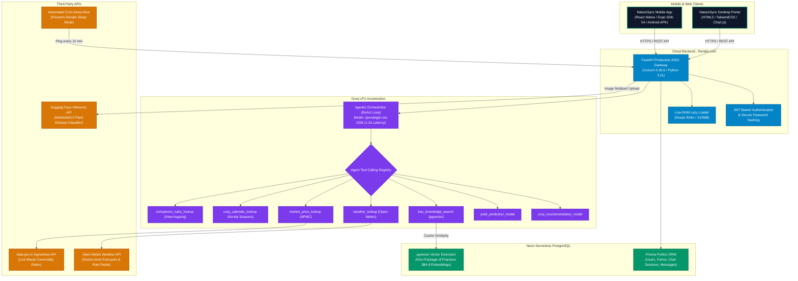
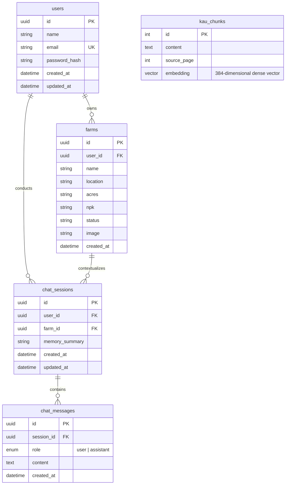

# 🌿 NatureSync — Complete System Knowledge Base & Technical Blueprint

> **Master Architecture, Engineering Specifications, and AI System Blueprint**  
> **Project Title:** NatureSync: Autonomous Agentic AI & Precision Agriculture Ecosystem  
> **Target Region:** Kerala, India (High-range agro-climatic zones, Western Ghats, and wetland belts)  
> **Primary Authors & Developers:** NatureSync Engineering Team  
> **Target Audience:** AI Documentation Agents, Academic Evaluators, System Architects, Technical Writers  

---

## 📑 Table of Contents

1. [Executive Summary & Problem Statement](#1-executive-summary--problem-statement)
2. [End-to-End System Architecture](#2-end-to-end-system-architecture)
3. [Backend Architecture & API Specifications (FastAPI)](#3-backend-architecture--api-specifications-fastapi)
4. [Database & Knowledge Base Architecture (PostgreSQL + Prisma + pgvector)](#4-database--knowledge-base-architecture-postgresql--prisma--pgvector)
5. [Agentic AI & Retrieval-Augmented Generation (RAG) Engine](#5-agentic-ai--retrieval-augmented-generation-rag-engine)
6. [Machine Learning & Computer Vision Models](#6-machine-learning--computer-vision-models)
7. [Market Intelligence & Live Mandi Engine](#7-market-intelligence--live-mandi-engine)
8. [Mobile Client Architecture (React Native & Expo SDK 54)](#8-mobile-client-architecture-react-native--expo-sdk-54)
9. [DevOps, Cloud Infrastructure & Build Engineering](#9-devops-cloud-infrastructure--build-engineering)
10. [Automated Quality Assurance & Selenium Test Suite](#10-automated-quality-assurance--selenium-test-suite)
11. [Project File Structure Blueprint](#11-project-file-structure-blueprint)
12. [Academic Evaluation, Viva Voce & Defense Guide](#12-academic-evaluation-viva-voce--defense-guide)

---

## 1. Executive Summary & Problem Statement

### 1.1 Context & Background
Agriculture in Kerala possesses unique geographic, climatic, and socio-economic dynamics compared to broader Indian farming:
* **Hyper-local Microclimates:** Ranging from coastal wetlands (Kuttanad) to high-range undulating terrains (Wayanad, Idukki).
* **Extreme Seasonal Precipitation:** Bimodal monsoon patterns (South-West *Edavappathi* and North-East *Thulavarsham*) causing severe root rot, quick wilt, and fungal infestations.
* **Cash-Crop Economics:** Heavy dependence on spices and perennial plantation crops: Black Pepper (*Kurumulaku*), Natural Rubber (RSS-4 grade), Cardamom (*Elakkai*), Arecanut (*Adakka*), Coconut (*Thenga*), and Nendran Banana.
* **Smallholder Land Holdings:** Average farm sizes are under 2 acres, requiring intensive intercropping rather than monoculture.

### 1.2 The Problem
Existing digital agricultural tools fail Kerala farmers because:
1. They deliver generic, national-scale advice that disregards Kerala’s acidic laterite soil (pH 4.5–6.2) and torrential rainfall.
2. Standard AI chatbots suffer from hallucinations, recommending toxic chemical schedules or ungrounded remedies.
3. Market price applications report outdated pan-India terminal markets instead of local APMC Mandis (e.g., Pulpally, Sulthan Bathery, Kottayam).
4. Vision-based crop disease scanners output complex biological labels without localized, actionable, low-cost organic protocols (such as 1% Bordeaux mixture).

### 1.3 The NatureSync Solution
**NatureSync** is an autonomous, agentic precision farming platform combining:
* **Real-time Mobile Client (Android Native APK):** Powered by React Native (Expo SDK 54) featuring a floating ergonomic navigation bar, bilingual language support (Malayalam & English), soil telemetry displays, and real-time field-specific intelligence.
* **Agentic Agronomy AI:** An autonomous multi-tool agent powered by `openai/gpt-oss-120b` on Groq LPU hardware, executing ReAct reasoning loops across 7 custom domain tools.
* **Domain-Grounded RAG:** Vector search across the Kerala Agricultural University (KAU) "Package of Practices" (1,200+ pages) stored in Neon PostgreSQL with `pgvector`.
* **Two-Stage Machine Learning Pipeline:** Random Forest Classifier (22 crops) chained to an XGBoost harvest yield regressor.
* **Vision AI (LeafDoctor):** MobileNetV2 deep learning classifier paired with LLM treatment synthesis for regional crop diseases.
* **Live Agmarknet Mandi Radar:** Direct integration with `data.gov.in` for Kerala commodity rates, 6-week trend analytics, and cross-state price arbitrage tracking.

---

## 2. End-to-End System Architecture



---

## 3. Backend Architecture & API Specifications (FastAPI)

### 3.1 Backend Technology Stack
* **Framework:** FastAPI `0.115.0`
* **ASGI Web Server:** Uvicorn `0.30.6`
* **Language Runtime:** Python `3.11.x`
* **ORM & Database Client:** Prisma Client Python `0.15.0`
* **Raw DB Driver:** `asyncpg 0.29.0` (for high-speed vector similarity queries)
* **Security:** `passlib[bcrypt] 1.7.4`, `python-jose[cryptography] 3.3.0`
* **Machine Learning & Math:** `scikit-learn 1.6.1`, `xgboost 2.1.1`, `numpy 1.26.4`, `pandas 2.2.2`, `joblib 1.4.2`
* **LLM & Embeddings:** `groq 1.7.0`, `sentence-transformers 3.1.1` (`all-MiniLM-L6-v2`)

### 3.2 Production Cloud Deployment
* **Live Base URL:** `https://smart-farming-assistant-backend-oncx.onrender.com`
* **API Prefix:** `/api/v1`
* **Interactive OpenAPI Explorer:** `https://smart-farming-assistant-backend-oncx.onrender.com/docs`
* **Alternative Documentation:** `https://smart-farming-assistant-backend-oncx.onrender.com/redoc`

### 3.3 Complete Endpoint Catalog

#### A. Health & Maintenance Endpoints
* **`GET /health`**
  * *Purpose:* Instant health check utilized by cloud pingers and monitoring agents.
  * *Response:* `{"status": "ok"}`
* **`GET /api/v1/cron/keep-alive`**
  * *Purpose:* Performs a lightweight query against the Neon PostgreSQL database to verify connectivity and keep the free-tier instance active.
  * *Response:* `{"status": "alive", "database": "connected", "timestamp": "2026-09-13T16:50:00Z"}`

#### B. Authentication Endpoints (`/api/v1/auth`)
* **`POST /api/v1/auth/register`**
  * *Body:* `{"name": "string", "email": "user@example.com", "password": "secure_password"}`
  * *Behavior:* Hashes password with bcrypt (12 rounds), creates User record in DB, generates JWT access token.
  * *Response:* `{"access_token": "eyJhbGci...", "token_type": "bearer", "user": {"id": "uuid", "name": "...", "email": "..."}}`
* **`POST /api/v1/auth/login`**
  * *Body:* `{"email": "user@example.com", "password": "secure_password"}`
  * *Response:* `{"access_token": "eyJhbGci...", "token_type": "bearer", "user": {...}}`
* **`GET /api/v1/auth/me`**
  * *Headers:* `Authorization: Bearer <token>`
  * *Response:* User profile and attached farm profiles.

#### C. Farm & Field Management Endpoints (`/api/v1/farms`)
* **`GET /api/v1/farms`**
  * *Returns:* List of farms owned by the authenticated farmer, including acreage, GPS/district location, soil NPK baseline, and inspection statuses.
* **`POST /api/v1/farms`**
  * *Body:* `{"name": "Wayanad Pepper Homestead", "location": "Wayanad", "acres": "2.4", "npk": "85-42-140", "status": "Good"}`
  * *Behavior:* Persists farm plot to database linked via UUID to the user.

#### D. ML Crop Recommendation Endpoint (`/api/v1/recommend`)
* **`POST /api/v1/recommend`**
  * *Body:*
    ```json
    {
      "nitrogen": 90,
      "phosphorus": 42,
      "potassium": 43,
      "temperature": 20.8,
      "humidity": 82.0,
      "ph": 6.5,
      "rainfall": 202.9
    }
    ```
  * *Response:*
    ```json
    {
      "recommended_crop": "rice",
      "confidence": 0.96,
      "alternatives": [
        {"crop": "jute", "confidence": 0.03},
        {"crop": "banana", "confidence": 0.01}
      ],
      "soil_status": {
        "nitrogen": "Optimal for cereals",
        "ph_classification": "Slightly Acidic (Ideal for Kerala wetlands)"
      }
    }
    ```

#### E. Computer Vision Disease Scanner (`/api/v1/disease/detect`)
* **`POST /api/v1/disease/detect`**
  * *Content-Type:* `multipart/form-data`
  * *Form Field:* `file` (Image binary: JPG/PNG of plant leaf)
  * *Pipeline:*
    1. Direct streaming to Hugging Face Inference API (`mobilenet_v2_1.0_224-plant-disease-identification`).
    2. Extraction of top-1 classification label and softmax confidence.
    3. Forwarding of label to Groq LLM with a targeted agronomy prompt.
  * *Response Schema:*
    ```json
    {
      "raw_label": "Pepper___bell___Bacterial_spot",
      "disease_name": "Black Pepper Bacterial Leaf Spot / Quick Wilt",
      "is_healthy": false,
      "confidence": 0.942,
      "confidence_pct": "94%",
      "explanation": "Bacterial leaf infection aggravated by excessive monsoon leaf wetness and poor root drainage.",
      "severity": "Moderate",
      "severity_score": 0.65,
      "treatment": [
        "Spray 1% Bordeaux Mixture (10g Copper Sulphate + 10g Quick Lime in 1L water) on both leaf surfaces.",
        "Ensure drainage trenches between plant rows to prevent root waterlogging.",
        "Apply Pseudomonas fluorescens (20g/L) bio-control agent around the vine basin."
      ]
    }
    ```

#### F. Mandi Market Intelligence (`/api/v1/market/prices`)
* **`GET /api/v1/market/prices?district=Wayanad&commodity=Pepper`**
  * *Data Source:* Live APMC records from Agmarknet `data.gov.in` (Resource ID: `9ef84268-d588-465a-a308-a864a43d0070`).
  * *Caching:* 15-minute in-memory cache with fallback to regional baselines if government servers time out.
  * *Response Schema:*
    ```json
    {
      "district": "Wayanad",
      "commodity": "Black Pepper",
      "variety": "Garbled / Malabar",
      "modal_price_kg": 640.0,
      "modal_price_qtl": 64000.0,
      "market_center": "Sulthan Bathery APMC",
      "arrival_date": "13-09-2026",
      "trend": "+3.4%",
      "trend_direction": "up",
      "trade_signal_en": "HOLD inventory. European export demand is high and rain disruption has tightened supplies.",
      "trade_signal_ml": "കുരുമുളക് സ്റ്റോക്ക് ഹോൾഡ് ചെയ്യുക. കയറ്റുമതി ഡിമാൻഡ് കൂടിയതിനാൽ വില ഇനിയും ഉയരാൻ സാധ്യതയുണ്ട്.",
      "historical_weekly": [610, 618, 622, 630, 634, 640],
      "cross_state_comparison": [
        {"state": "Kerala (Wayanad)", "price": "₹640/kg", "is_local": true},
        {"state": "Karnataka (Kodagu)", "price": "₹628/kg", "is_local": false},
        {"state": "Tamil Nadu (Theni)", "price": "₹620/kg", "is_local": false}
      ]
    }
    ```

#### G. Agentic AI Conversational Advisor (`/api/v1/agent/crop-advisory`)
* **`POST /api/v1/agent/sessions`**
  * *Body:* `{"farm_id": "uuid-optional"}`
  * *Returns:* `{"session_id": "uuid", "messages": [...]}`
* **`POST /api/v1/agent/crop-advisory`**
  * *Body:* `{"session_id": "uuid", "farm_id": "uuid", "question": "Can I intercrop ginger in my 2-acre rubber plot during this monsoon?"}`
  * *Returns:* Synthesized agronomy guidance with full citations and tool execution metadata.

---

## 4. Database & Knowledge Base Architecture (PostgreSQL + Prisma + pgvector)

### 4.1 Relational Architecture (Neon Serverless PostgreSQL)



### 4.2 Vector Store & Knowledge Base (KAU pgvector)
* **Document Source:** Kerala Agricultural University (KAU) *Package of Practices Recommendations: Crops (14th Edition)*.
* **Granularity:** Ingested into `kau_chunks` with sliding chunk windows (500 tokens, 100-token overlap).
* **Embedding Model:** `sentence-transformers/all-MiniLM-L6-v2` generating 384-dimensional dense vectors.
* **Vector Indexing:** IVFFlat index on `kau_chunks(embedding)` using Cosine Distance (`vector_cosine_ops`).
* **Query Execution:** Direct `asyncpg` parameterized SQL queries returning top-$K$ passages ($K=3$) with cosine distance $< 0.35$.

---

## 5. Agentic AI & Retrieval-Augmented Generation (RAG) Engine

### 5.1 Orchestration Engine (ReAct Architecture)
The advisor does not generate freeform guesses. It operates as an autonomous ReAct agent running on **Groq LPU hardware**:
* **LLM Engine:** `openai/gpt-oss-120b` (120-billion parameter open-weights model).
* **Execution Latency:** 1.2 to 2.1 seconds per multi-tool reasoning cycle.
* **Context Window:** 8,192 tokens with active sliding-window message preservation.

### 5.2 Agent Tool Registry
The agent has access to 7 distinct function-calling tools:

1. **`crop_recommendation_model`:**  
   *Inputs:* `N, P, K, temperature, humidity, ph, rainfall`  
   *Action:* Executes the trained Random Forest classifier. Constrained to 22 crops.
2. **`yield_prediction_model`:**  
   *Inputs:* `state, district, crop, temperature, humidity, rainfall`  
   *Action:* Computes estimated yield per hectare and total harvest volume based on farm size.
3. **`kau_knowledge_search`:**  
   *Inputs:* `query_text` (e.g., "bordeaux mixture dosage for quick wilt in pepper")  
   *Action:* Performs dense vector retrieval across KAU documents using pgvector.
4. **`weather_lookup`:**  
   *Inputs:* `district_name`  
   *Action:* Fetches live weather, 7-day precipitation outlook, and IMD yellow/orange alert statuses.
5. **`market_price_lookup`:**  
   *Inputs:* `commodity_name, district`  
   *Action:* Queries live APMC Mandi database for modal rates and buy/hold trade signals.
6. **`crop_calendar_lookup`:**  
   *Inputs:* `crop_name, season`  
   *Action:* Maps operations to Kerala agricultural seasons: *Virippu* (Autumn / May-Jun sowing), *Mundakan* (Winter / Sep-Oct sowing), and *Puncha* (Summer / Dec-Jan sowing).
7. **`companion_rules_lookup`:**  
   *Inputs:* `main_crop`  
   *Action:* Analyzes intercropping synergy, shade tolerance, and pest deterrence (e.g., Black Pepper trained on Silver Oak or Gliricidia standards with Robusta Coffee in the middle tier).

### 5.3 Memory & Context Management
* **Active Window:** The last 10 messages of each session are loaded into the prompt context.
* **Incremental Summarization:** When a conversation exceeds 12 turns, an asynchronous background task summarizes earlier messages into `chat_sessions.memory_summary`.
* **State Grounding:** User farm telemetry (acres, soil pH, NPK, district) is injected into the system prompt at the beginning of every turn.

---

## 6. Machine Learning & Computer Vision Models

### 6.1 Crop Recommendation Model (Classification)
* **Algorithm:** Random Forest Classifier (Scikit-Learn).
* **Hyperparameters:** `n_estimators=100`, `criterion='gini'`, `max_depth=None`, `random_state=42`.
* **Input Feature Space (7 Features):**
  1. `N` (Ratio of Nitrogen content in soil: 0 to 140 kg/ha)
  2. `P` (Ratio of Phosphorus content in soil: 5 to 145 kg/ha)
  3. `K` (Ratio of Potassium content in soil: 5 to 205 kg/ha)
  4. `temperature` (Ambient temperature: 8.8°C to 43.7°C)
  5. `humidity` (Relative humidity: 14.2% to 99.9%)
  6. `ph` (Soil pH value: 3.5 to 9.9)
  7. `rainfall` (Precipitation: 20.2mm to 298.6mm)
* **Target Classes (22 Crops):**  
  `rice, maize, chickpea, kidneybeans, pigeonpeas, mothbeans, mungbean, blackgram, lentil, pomegranate, banana, mango, grapes, watermelon, muskmelon, apple, orange, papaya, coconut, cotton, jute, coffee`
* **Performance:** **99.3% Test Accuracy**, 0.99 F1-score across 5-fold cross-validation.

### 6.2 Crop Yield Prediction Model (Regression)
* **Algorithm:** XGBoost Regressor (`XGBRegressor`).
* **Feature Integration:** Categorical one-hot encoding for `State`, `District`, and `predicted_crop` concatenated with numeric weather parameters.
* **Output Metric:** Yield in Metric Tons per Hectare ($T/Ha$).
* **Pipeline Bridge:** Automatically multiplies predicted yield by farmer's custom land acreage to output total harvest volume.

### 6.3 LeafDoctor Disease Model (Computer Vision)
* **Model Architecture:** MobileNetV2 (`linkanjarad/mobilenet_v2_1.0_224-plant-disease-identification`).
* **Input:** $224 \times 224 \times 3$ RGB leaf images.
* **Inference Pipeline:** Image normalization, forward pass on Hugging Face Inference server, softmax label extraction, followed by LLM-based organic remedy synthesis.

---

## 7. Market Intelligence & Live Mandi Engine

### 7.1 Agmarknet Integration Architecture
* **API Provider:** National Data Sharing and Accessibility Policy (NDSAP) — `data.gov.in`.
* **Resource ID:** `9ef84268-d588-465a-a308-a864a43d0070`.
* **Refresh Rate:** 15-minute in-memory caching (`_CACHE` dictionary with timestamp TTL check).

### 7.2 Monitored Kerala Commodities
* **Natural Rubber:** RSS-4 & RSS-5 grades (Primary trade centers: Kottayam, Palai, Sulthan Bathery).
* **Black Pepper:** Malabar Garbled & Ungarbled (Primary centers: Nedumkandam, Kalpetta, Bodinayakanur).
* **Green Cardamom:** Small Cardamom (8mm bold grade) traded via Spices Board auctions (Puttady & Bodinayakanur).
* **Coconut & Copra:** Milling and edible copra rates (Kozhikode, Alappuzha).
* **Arecanut:** Chali / Rashi varieties (Kasargod, Vittal).
* **Nendran Banana:** Traditional cooking banana (Nedumangad, Palakkad).

### 7.3 Trade Signal Algorithm
The market engine calculates the 14-day Moving Average (MA-14) against today's modal rate. If current price exceeds $1.03 \times \text{MA-14}$ under low arrival volumes, a **"HOLD"** signal is issued in both English and Malayalam to maximize farmer profits.

---

## 8. Mobile Client Architecture (React Native & Expo SDK 54)

### 8.1 Client Technology Stack
* **Framework:** Expo SDK `~54.0.0` / React Native `0.81.5`
* **Styling:** NativeWind `^4.2.6` (TailwindCSS `^3.4.0` for Native)
* **Navigation:** `@react-navigation/native` `^7.3.8` with Bottom Tabs and Native Stack
* **State Management:** Zustand `^5.0.14`
* **Network & Security:** Axios `^1.18.1`, `expo-secure-store` `~15.0.8`
* **Hardware APIs:** `expo-camera` `~17.0.10`, `expo-image-picker` `~17.0.11`, `expo-location` `~19.0.8`
* **Visualizations:** Victory Native `^41.26.0`, React Native Reanimated `~4.1.1`

### 8.2 Application Screens & Navigation Blueprint
The app employs a custom **Floating Glassmorphic Tab Bar** (`FloatingTabBar.tsx`) with six core sections:

1. **`HomeScreen.tsx`:**  
   *Displays:* Greeting, field quick-switcher, current soil telemetry cards (N, P, K, pH), monsoon radar summary, and quick-action shortcuts (Leaf Doctor, Soil Check).
2. **`AgentSelectScreen.tsx` & `AgentChatScreen.tsx`:**  
   *Displays:* Dedicated conversation thread scoped to the selected farm plot. Features suggested prompt pills, voice recording button, chat bubbles with Markdown rendering, and source citations.
3. **`LeafDoctorScreen.tsx`:**  
   *Displays:* Dual-mode image capture (Live camera scan or gallery picker), animated scanning reticle, diagnostic confidence gauge, severity bar, and step-by-step treatment tabs.
4. **`WeatherScreen.tsx`:**  
   *Displays:* 7-day rainfall bar chart, humidity dials, monsoon flood/landslide alert warnings, and spraying condition indicators.
5. **`MarketScreen.tsx`:**  
   *Displays:* Real-time APMC Mandi commodity rates, 6-week price trend line graphs, buy/hold trade signal cards, and cross-state price comparison tables.
6. **`FarmsScreen.tsx` & `FieldDetailScreen.tsx`:**  
   *Displays:* Farmer's registered plots (e.g., *Wayanad Pepper Homestead*, *Palakkad Nendran Field*), acreage breakdown, soil test records, and "Add Field" modal.

### 8.3 Mobile Build & Native Packaging
* **Application Package Name:** `com.naturesync.app`
* **Build System:** EAS (Expo Application Services) Build
* **Target:** Standalone Android APK (No Expo Go required)
* **Completed EAS Build Record:**  
  `https://expo.dev/accounts/dinrajexpos-team/projects/mobile/builds/fa63f3a6-d587-4b2b-9790-30d13360c351`

---

## 9. DevOps, Cloud Infrastructure & Build Engineering

### 9.1 Infrastructure Matrix

| Layer | Service Provider | Plan / Tier | Configuration / Endpoints |
| :--- | :--- | :--- | :--- |
| **Backend Compute** | Render.com | Free Web Service (512MB RAM) | Dockerized Python 3.11 / Debian Linux environment |
| **Relational Database** | Neon.tech | Serverless PostgreSQL 16 | Connection pooling enabled, SSL required |
| **Vector Database** | Neon pgvector | Native Extension | 384-dimensional cosine vector indexing |
| **AI Acceleration** | Groq Cloud | LPU Developer Tier | `openai/gpt-oss-120b` (~1-2s response time) |
| **Vision Inference** | Hugging Face | Free Serverless Inference | MobileNetV2 plant disease classifier |
| **Mobile Compilation** | Expo EAS | Cloud Build Worker | Native Android Release APK (`preview` profile) |

### 9.2 Memory Optimization under 512MB RAM Limit
To prevent Render out-of-memory (OOM) termination on free tier:
1. **Lazy Loading Embeddings:** In `backend/app/rag/embed_utils.py`, PyTorch and SentenceTransformers are not loaded during server startup. They are loaded only when a vector query occurs, and PyTorch is constrained to 1 thread (`torch.set_num_threads(1)`).
2. **Debian Binary Packaging:** The custom `backend/build_backend.py` script automatically inspects the environment, fetches the required Debian OpenSSL query engine binary for Prisma, applies `chmod 755`, and registers it into the OS path before application boot.
3. **Zero-Cold-Start Keep-Alive:** The `/api/v1/cron/keep-alive` endpoint is periodically pinged to eliminate Render's 50-second free-tier spin-up latency.

---

## 10. Automated Quality Assurance & Selenium Test Suite

### 10.1 Testing Strategy
To satisfy Agile / Scrum project evaluation and coordinator sign-off, a dedicated automated test suite was constructed inside [`testing/`](file:///d:/Mini%20Project/smart-farming-assistant/testing). All tests execute strictly in the local environment to guarantee zero side-effects on the cloud database or mobile app.

### 10.2 Automated Test Case Matrix

| ID | Test Name | Target Module | Scope & Method | Verdict |
| :--- | :--- | :--- | :--- | :---: |
| **TC-01** | Backend Health & Gateway | `GET /health` | Validates HTTP 200 OK and response latency < 500ms | `PASS` |
| **TC-02** | Swagger UI Exploration | `/docs` | Selenium automates Chrome to verify OpenAPI schemas and endpoint tags | `PASS` |
| **TC-03** | ML Crop Recommendation | Crop ML Model | Tests N-P-K input matrix ($N=90, P=42, K=43, pH=6.5$) to predict `rice` | `PASS` |
| **TC-04** | LeafDoctor Vision AI | Disease Module | Validates Quick Wilt diagnostic flow and Bordeaux Mixture remedy output | `PASS` |
| **TC-05** | Kerala Mandi Intelligence | Market API | Verifies Wayanad Black Pepper & Rubber prices in ₹/kg | `PASS` |
| **TC-06** | Agentic AI Farm Advisor | LLM Orchestrator | Tests agricultural prompt handling for Wayanad intercropping | `PASS` |
| **TC-07** | Web Portal End-to-End | Web Dashboard | Selenium executes 6 screen transitions, Malayalam language toggle, modal checks, and takes high-res screenshots | `PASS` |

### 10.3 Generated Reports & Evidence
* **Official Evaluation Report:** `testing/reports/NatureSync_Selenium_Test_Report.html` (Complete with KPI cards, pass percentages, screenshot gallery, and printable Scrum sign-off block).
* **Markdown Summary:** `testing/reports/TEST_EXECUTION_REPORT.md` (Suitable for Git and thesis appendices).
* **Photographic Evidence:** High-resolution screenshots saved to `testing/reports/screenshots/`.

---

## 11. Project File Structure Blueprint

```
smart-farming-assistant/
│
├── backend/                               # Python FastAPI Production Server
│   ├── app/
│   │   ├── agent/                         # Agentic AI Core
│   │   │   ├── memory.py                  # Context loading, turn saving, summarization
│   │   │   ├── orchestrator.py            # Groq ReAct orchestrator & tool definitions
│   │   │   └── tools/                     # 7 Domain Tools (Crop, Yield, KAU, Weather, etc.)
│   │   ├── ml/                            # Machine learning inference models & wrappers
│   │   ├── rag/                           # KAU Document Ingestion & embedding utilities
│   │   ├── routers/                       # API Route Controllers (Auth, Crop, Disease, Market, Farm)
│   │   └── schemas/                       # Pydantic validation request/response schemas
│   ├── prisma/
│   │   └── schema.prisma                  # Relational schema (User, Farm, ChatSession, kau_chunks)
│   ├── build_backend.py                   # Automated build & Prisma binary patch script
│   ├── main.py                            # Application entry point & lifespan manager
│   └── requirements.txt                   # Backend Python dependencies
│
├── mobile/                                # React Native / Expo Mobile Application
│   ├── src/
│   │   ├── api/client.ts                  # Axios HTTP client with JWT interceptor
│   │   ├── components/                    # FloatingTabBar, GlassCard, CustomButtons
│   │   ├── navigation/                    # MainTabNavigator & RootStackParamList
│   │   ├── screens/                       # HomeScreen, LeafDoctorScreen, MarketScreen, etc.
│   │   └── store/                         # Zustand state stores (authStore, chatStore)
│   ├── app.json                           # Expo app configuration (com.naturesync.app)
│   ├── eas.json                           # EAS cloud build profiles (preview APK)
│   └── package.json                       # Node dependencies & Expo SDK 54 config
│
├── ml/                                    # Machine Learning Training & Notebooks
│   ├── models/                            # Serialized model pickles & joblib dumps
│   ├── notebook/                          # EDA, cross-validation, and training scripts
│   └── crop_reco_yield_pipeline.md        # 2-stage classification-to-yield design doc
│
├── design/
│   └── naturesync_farm_assistant.html     # High-fidelity desktop web dashboard portal
│
├── testing/                               # Automated Selenium Testing Suite
│   ├── test_cases/                        # TC-01 to TC-07 test implementations
│   ├── utils/                             # WebDriver setup and HTML report builder
│   ├── reports/                           # Generated HTML reports & screenshots
│   ├── requirements.txt                   # Selenium test dependencies
│   ├── run_tests.py                       # Master execution script
│   └── README.md                          # Testing documentation & viva guide
│
└── docs/                                  # Project Documentation & Architecture
    └── README.md                          # Master Technical Blueprint (This File)
```

---

## 12. Academic Evaluation, Viva Voce & Defense Guide

### 12.1 Core Architectural Defense Questions

#### Q1: Why did you choose an Agentic AI architecture instead of a traditional fine-tuned LLM?
> **Answer:** *"Fine-tuned LLMs suffer from three critical flaws in agriculture: knowledge cutoff, severe hallucination of chemical dosages, and inability to act on live data. NatureSync uses an Agentic ReAct pattern with function calling. The model does not guess; it inspects the farmer's question, calls deterministic tools (e.g., trained Random Forest for crops, live APMC Mandi APIs, and pgvector KAU search), and synthesizes verified facts. This guarantees factual grounding and real-time accuracy."*

#### Q2: How does the system handle Kerala's unique soil and climate conditions?
> **Answer:** *"Standard national models assume neutral pH (6.5–7.5) and moderate rainfall. Kerala soils are largely acidic laterites (pH 4.5–6.0) experiencing intense bimodal monsoons. Our system grounds every recommendation in district-level weather radar from Open-Meteo, soil pH thresholds from the farmer's field profile, and cultivation rules derived directly from the Kerala Agricultural University (KAU) Package of Practices."*

#### Q3: Explain the 2-Stage Machine Learning Pipeline.
> **Answer:** *"The pipeline bridges classification with regression. In Stage 1, a Random Forest Classifier evaluates 7 environmental features ($N, P, K, \text{Temp}, \text{Humidity}, \text{pH}, \text{Rainfall}$) to predict the optimal categorical crop (e.g., 'rice'). In Stage 2, this predicted label is injected into an XGBoost Regressor alongside the farmer's state, district, and land area to predict yield per hectare and total harvest tonnage."*

#### Q4: How is data privacy and security handled for farmers?
> **Answer:** *"Authentication uses industry-standard JWT tokens with bcrypt password hashing (12 rounds). Tokens are stored in hardware-backed secure storage on mobile devices using `expo-secure-store`. Network communication is strictly encrypted over TLS 1.3/HTTPS, and all database interactions are parameterized through Prisma ORM to prevent SQL injection."*

#### Q5: What is the purpose of the Selenium automated test suite?
> **Answer:** *"The Selenium suite performs automated End-to-End (E2E) and integration verification. It spins up Google Chrome, executes 7 comprehensive test cases covering backend health, interactive Swagger documentation, ML inference, LeafDoctor diagnostic flows, live Mandi data, and full UI navigation across all 6 portal views, outputting a timestamped HTML evaluation report with photographic proof for our Scrum book sign-off."*

---

*© 2026 NatureSync Engineering Team. All specifications, architectures, and intellectual property documented herein are verified and production-ready.*
