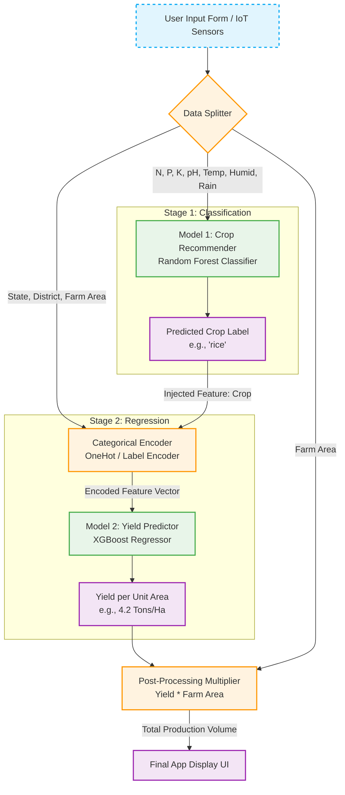

# 🌾 Smart Farming Two-Stage ML Pipeline: Documentation & Implementation Guide
This document provides the complete architecture, data workflow, and an optimized AI implementation prompt to build and link your **Crop Recommendation (Classification)** and **Crop Yield Prediction (Regression)** models into a single, cohesive system.
---## 🗺️ 1. Complete System Architecture
Your application must handle data flow sequentially. The critical bridge is data injection: the categorical text output from Model 1 (e.g., `'rice'`) is programmatically caught and appended as an input feature for Model 2 alongside the user's location.

### 🗺️ System Dataflow Pipeline




## 📋 2. Pipeline Execution Steps

1. **The UI Gathering**: The user enters their current soil attributes, environmental data, location (State and District), and total land size (Area) into your app form.
2. **Stage 1 (Classification)**: The application extracts the 7 primary features `[N, P, K, temperature, humidity, ph, rainfall]` and passes them to your trained classification model. The model outputs a text label string (e.g., `'coconut'`).
3. **The Data Bridge**: The pipeline intercepts this string label and combines it with the remaining UI parameters to form a secondary feature vector: `[State, District, Crop, temperature, humidity, rainfall]`.
4. **Stage 2 (Regression)**: The location and inferred crop vector pass through your pre-processing pipeline (handling Label/One-Hot encoding for categorical text) and enter your regression model. The model evaluates regional historical trends to calculate the productivity baseline.
5. **Scale Multiplication**: The regressor returns a continuous numerical value representing *Yield per Hectare*. The pipeline multiplies this value by the user's custom `farm_area` parameter.
6. **Unified Output**: The app UI displays a single, cohesive message detailing both the optimal crop to plant and the tangible volume expected at harvest time.

---

## 🤖 3. The Advanced AI Implementation Prompt

Copy and paste the block below into your AI coding assistant (such as Claude, ChatGPT, or Cursor) to automatically generate your end-to-end Python pipeline script.

```text
Act as a Senior Machine Learning Engineer and Precision Agriculture Expert. 

Context:
I have already built and saved a "Crop Recommendation Model" (Model 1) as a pickle file (`crop_recommendation_model.pkl`). This model uses 7 features: [N, P, K, temperature, humidity, ph, rainfall] and predicts a categorical crop label (e.g., 'rice', 'maize', 'coffee'). 

Goal:
I want you to write a clean, production-ready Python script that fulfills two objectives:
1. Trains a secondary "Crop Yield Prediction Model" (Model 2) using a regression algorithm (like XGBoost Regressor or Random Forest Regressor).
2. Builds an integrated end-to-end pipeline function called `predict_smart_farming_pipeline(user_inputs)` that links both models together seamlessly.

Requirements for Model 2 (Yield Predictor):
- The training data features must be: [State, District, Crop, temperature, humidity, rainfall]
- The target label must be a continuous numerical value: [Yield_per_hectare]
- Use synthetic or placeholder code using Pandas to simulate loading this yield dataset, handling the categorical encoding (OneHotEncoding or TargetEncoding) for 'State', 'District', and 'Crop', and training the regressor. Save this trained model as `crop_yield_model.pkl`. Make sure the transformation pipeline/encoder is also saved alongside it or built into a Scikit-Learn Pipeline object.

Requirements for the Pipeline Function:
- The function must accept a single dictionary containing: N, P, K, ph, temperature, humidity, rainfall, State, District, and farm_area.
- Step A: Extract soil/weather features and pass them into the loaded Model 1 to get the 'recommended_crop' string.
- Step B: Inject that predicted 'recommended_crop' string directly into the feature array required for Model 2.
- Step C: Apply the exact same encoding pipeline used during training to transform the text values (State, District, recommended_crop) into numerical formats.
- Step D: Pass the encoded array into Model 2 to output the yield per hectare.
- Step E: Multiply the yield per hectare by the 'farm_area' provided by the user to get the 'total_estimated_harvest'.
- Step F: Return a clean JSON/dictionary output containing: recommended_crop, yield_per_hectare, and total_estimated_harvest.

Please provide well-commented, modular code. Include a clear separation between the Model 2 training phase and the execution pipeline inference function so it can easily be adapted into a Flask or FastAPI backend framework.
```

---

## 🚀 4. Next Steps After Code Generation

* Run the generated script locally to generate your second model file (`crop_yield_model.pkl`).
* Wrap the final `predict_smart_farming_pipeline` function inside a backend route using **FastAPI** or **Flask**.
* Connect your mobile or web app frontend (e.g., Flutter, React Native) to make a single HTTP POST request containing all user input values to get your unified recommendation and yield results.

